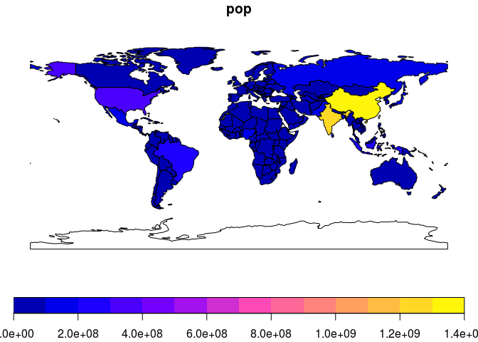
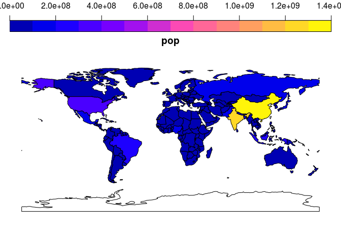

Welcome to R for Transport Applications.

Comments, slide and links from the course can be found here.

Links
-----

-   [Gecomputation with R](http://geocompr.robinlovelace.net/) (Lovelace, Nowosad, and Muenchow 2018)
-   [R for Data Science](http://r4ds.had.co.nz/) (Grolemund and Wickham 2016)
-   [Efficient R Programming](https://csgillespie.github.io/efficientR/) (Gillespie and Lovelace 2016)
-   [sf](https://cran.r-project.org/web/packages/sf/vignettes/) package vignettes (see also `vignette(package = "sf")`)
-   [dodgr website](https://atfutures.github.io/dodgr/) (contains vignettes)
-   [tutorial by Mark Padgham](https://github.com/mpadge/r4trans-april18/blob/master/bristol.Rmd)

Notes from day 1
----------------

``` r
# demonstration of key.pos
library(sf)
```

    ## Linking to GEOS 3.5.1, GDAL 2.2.2, proj.4 4.9.2

``` r
library(spData)
plot(world["pop"])
```



``` r
plot(world["pop"], key.pos = 3)
```



``` r
# for more info see:
# https://cran.r-project.org/web/packages/sf/vignettes/sf5.html
# vignette("sf")
?sf::plot
```

Demonstration of sfc to sf conversion:

``` r
asia = world[world$continent == "Asia", ]
asia = st_union(asia)
class(asia)
```

    ## [1] "sfc_MULTIPOLYGON" "sfc"

``` r
asia_df = st_sf(
  data.frame(name = "asia"),
  geometry = asia
  )
class(asia_df)
```

    ## [1] "sf"         "data.frame"

Reading-in data - see Chapter 6 of Geocomputation with R.

``` r
# from a file:
u = "https://github.com/martinjc/UK-GeoJSON/blob/master/json/eurostat/sco/topo_nuts2.json"
download.file(u, "scot.geojson") # download
```

``` r
lnd = read_sf("~/repos/Creating-maps-in-R/data/lnd.geojson")
class(lnd)
write_sf(lnd, "lnd.geojson")
saveRDS()
write_rds(lnd, "lnd.rds")
file.size("lnd.geojson") / 1e6
file.size("lnd.rds") / 1e6
plot(lnd)
library(osmdata)
q = opq(bbox = "Leeds") %>% 
  add_osm_feature("leisure", value = "park")
res = osmdata_sf(q = q)
plot(res$osm_lines$geometry)
```

References
----------

Gillespie, Colin, and Robin Lovelace. 2016. *Efficient R Programming: A Practical Guide to Smarter Programming*. O’Reilly Media. <https://csgillespie.github.io/efficientR/>.

Grolemund, Garrett, and Hadley Wickham. 2016. *R for Data Science*. 1 edition. O’Reilly Media.

Lovelace, Robin, Jakub Nowosad, and Jannes Muenchow. 2018. *Geocomputation with R*.
