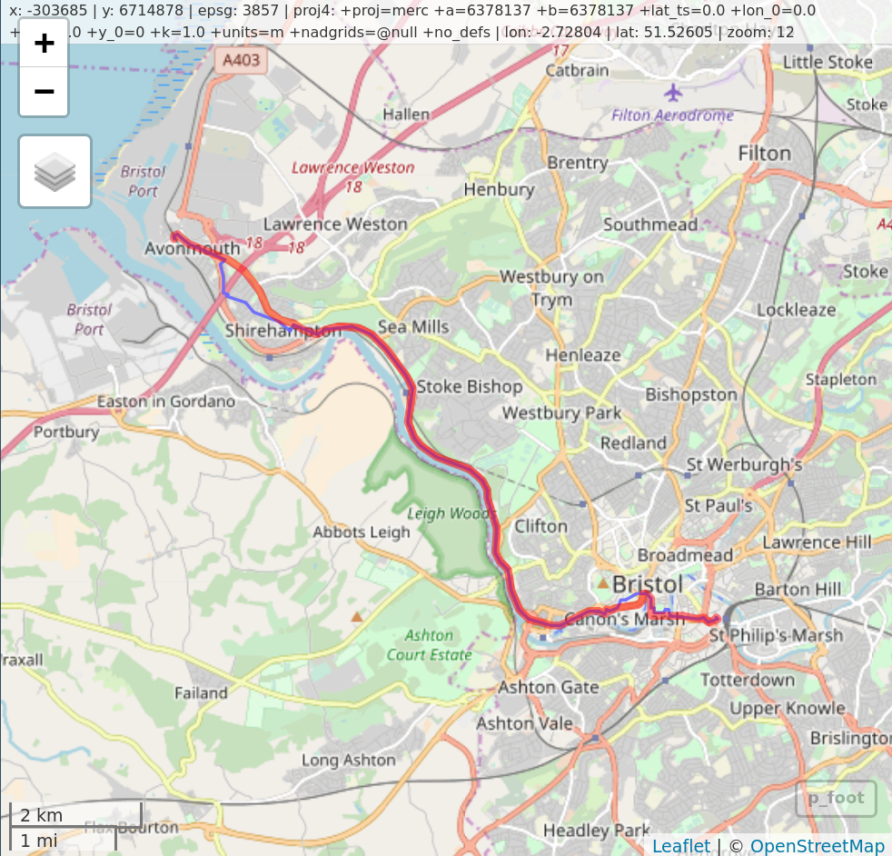

## An overview of the course

> This course teaches two skill-sets that are fundamental in modern transport research: programming and data analytics, with a focus on spatial data. Combining these enables powerful transport planning and analysis workflows for tackling a wide range of problems, including:

- How to effectively handle large transport datasets?
- Where to locate new transport infrastructure?
- How to develop automated and reproducible transport planning workflows?
- How can increasingly available datasets on air quality, traffic and active travel be used to inform policy?
- How to visualise results in an attractive and potentially on-line and interactive manner?

## Day 2: Transport applications

- Working with origin-destination (OD) data
- Converting origin-destination data to lines and routes
- Access and use of OSM data from R
- Route networks
- Visualising transport data

## Resources

- The course website/wiki is [github.com/ITSLeeds/R4TA](https://github.com/ITSLeeds/R4TA)
- Geocomputation with R [@lovelace_geocomputation_2018]
    - ~~Chapter 2 on spatial data classes~~ (printed)
    - Chapter 7 on transport applications (printed)
    - ~~Chapters 3 + 6 on the tidyverse + data I/O~~

- Efficient R Programming [@gillespie_efficient_2016]
- **stplanr**: A package for Transport Planning ([`stplanr-paper`](https://cran.r-project.org/web/packages/stplanr/vignettes/stplanr-paper.html))

## Visualisation

- Vital for communication
- Increasingly interactive

```{r, echo=FALSE, out.width="80%"}
knitr::include_graphics("https://atfutures.github.io/img/blogs/accra-flows.jpg")
```

# Recap

## R as a giant calculator

R has a unique syntax [@rcoreteam_language_2017]

**In R:**

- Everything that exists is an object
- Everything that happens is a function

E.g., load a data object and find its dimension:

```{r}
data(mpg, package = "ggplot2") # load the object mpg
dim(mpg) # use a function (dim) to do something with it
```


# R/RStudio tricks

> - Find and write down some useful shortcuts (`Alt-Shift-K` on Windows/Linux)
> - Is it part of a longer story that will ultimately be shared? (use script files)
> - Is it just playing that does not need to be stored? (use the console)
> - You can switch effortlessly between them with `Ctl+1` and `Ctl+2`.

Other shortcuts:

- Magic `Tab` button
- Pressing `Up` in console

## Assignment

- Be warned: easy to overwrite data

```{r}
x = 5 # the same as x <- 5
(x = x + 1)
```

- Warning when using `=`

```{r, eval=FALSE}
system.time(x_big <- (1:1e7))
system.time({x_big = 1:1e7}) 
```

## More on assignment

- Warning when using `<-`

```{r, eval=FALSE}
x < -5
x <-5
```

## The dplyr pipe

```{r, eval = FALSE}
library(tidyverse)
5 %>% 
  sin(.) %>% 
  cos(.) -> res
res = cos(sin(5))
```

## Exercises (in groups)

- In groups of 2, 3 or 4: 
- Decide on a concrete objective --- something you'd like to acheive by the end of the day
- Break that task down into chunk and write them on a blank piece of paper

## Introduction to stplanr

- What it does - input data

```{r}
library(stplanr)
head(flow[1:3])
plot(cents_sf)
```

## From od to spatial data

```{r}
l = od2line(flow, cents_sf)
plot(l["All"], lwd = l$All / mean(l$All))
```

## Exercises (options)

- Work-though Chapter 7.3 
- Find and workthough the `stplanr-paper` vignette (especially if interested in OD data)
- Try to create a function `journey_via()` that routes via a ... (e.g. pub on way to station - advanced)

## Heads-up: what's coming

```{r, echo=FALSE}

```

## References
